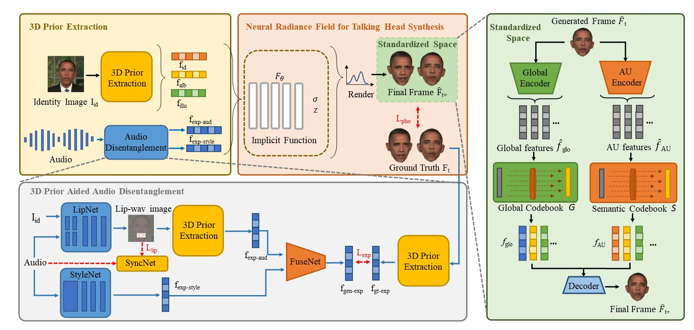

# NeRF-3DTalker: Neural Radiance Field with 3D Prior Aided Audio Disentanglement for Talking Head Synthesis

Official PyTorch implementation for the paper:

> **NeRF-3DTalker: Neural Radiance Field with 3D Prior Aided Audio Disentanglement for Talking Head Synthesis**.
>
> Xiaoxing Liu, Zhilei Liu,  Chongke Bi

<p align="center">

</p>

## News
Thank you to all the reviewers for their feedback. Moving forward, we are committed to ongoing research to enhance the efficiency and performance of this project.

-


## Environment

- python 3.7
- pytorch 1.13.1
- torchvision 0.14.1

Create conda environment:
```bash
conda create -n xxx python=3.7
conda activate xxx
pip install -r requirements.txt
```

## **Dataset**

1. Download the dataset: https://github.com/yerfor/GeneFace

2. We provide preprocessing code for datasets. You can use /pre_data_code/ to preprocess datasets.

3. Additionally, you need to download [Openface](https://ieeexplore.ieee.org/document/8373812)
to extract AUs from images.
The final format of the dataset is illustrated in the following figure:

./dataset/Obama:

    |——au
      |——0.csv
      |——1.csv
      |——...
    |——lipwav
      |——0.jpg
      |——1.jpg
      |——...
    |——png
      |——0.jpg
      |——0_lm2d.txt
      |——0_mask.png
      |——0_nl3dmm.pkl
      |——1.jpg
      |——1_lm2d.txt
      |——1_mask.png
      |——1_nl3dmm.pkl
      |——...
    |——aud.wav

## **Acknowledgements**
Our codes are based on the following repos:
* [Wav2lip](https://dl.acm.org/doi/10.1145/3394171.3413532)
* [SadTalker](https://ieeexplore.ieee.org/document/10204743)
* [HeadNeRF](https://ieeexplore.ieee.org/document/9880349)
* [CodeTalker](https://ieeexplore.ieee.org/document/10204746)
